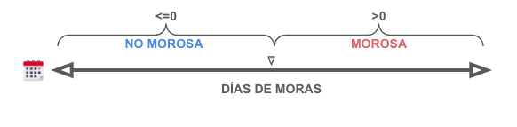

# Challenge DS Xepelin

## 1 - Problema de negocio y entendimiento del problema

### ¿Cuál es exactamente el problema de negocio a resolver?

Uno de los productos que ofrecemos en Xepelin es el denominado Financiamiento Directo,
en el cual una empresa puede solicitar financiar sus cuentas por cobrar a través de la
factura que se emite. Existen variables asociadas a la empresa que solicita la operación de
Financiamiento Directo (Emisor) y al responsable de pago de la factura (Pagador) que son
relevantes para medir el riesgo asociado a cada operación.

### ¿Está la solución de Data Science formulada apropiadamente para resolver el problema de negocio?

El problema de negocio se puede resolver desarrollando un modelo de clasificación binaria que pueda predecir si una factura será morosa o no. Esto permitirá al área responsable del producto de Financiamiento Directo evaluar el riesgo asociado a cada operación y tomar decisiones informadas sobre si operar o no.

### Definición de la variable a predecir y posibles variables de entradas

Las variables disponibles son las siguientes:

- invoiceId: Identificador de la factura.
- businessId: Identificador del emisor (business).
- payerId: Identificador del pagador de la factura.
- montoFactura: Monto de la factura de la operación.
- relationDays: Días desde el inicio de la relación business-payer.
- relationRecurrence: Recurrencia promedio de la interacción (últimos 12 meses).
- issuerInvoicesAmount: Monto total de facturas emitidas por businessId.
- issuerCancelledInvoices: Número de facturas canceladas del businessId.
- diasActividadPagador: Días transcurridos desde el inicio de actividades del
  -agador (payerId.)
- Clients12Months: Cantidad de clientes del emisor businessId (últimos 12 meses).
- mora: Días de mora de la operación.

Dadas las variables disponibilizadas por el equipo de Xepelin, tenemos que plantearnos como llevar estas a un camino que nos permita resolver el problema de negocio.

**Definimos el target**:

*Definición de morosidad*: El objetivo del proyecto es generar un modelo predictor que permita al equipo de riesgo suponer adecuadamente la mora de una factura para decidir si operar o no. Es decir, la idea sería poder medir el riesgo de morosidad del pagador o la probabilidad de que la factura no sea pagada. Dado los datos analizados, podríamos decir que si el valor del campo mora es mayor que 0, podría considerarse al cliente como moroso.

**Hipótesis sobre posibles motivos de que una factura sea morosa:**

- Monto de la factura (montoFactura): podrían existir umbrales de monto a partir del cual una facturar se podría considerar significativa. Si el valor de una factura es alto, podría ser que tenga mas probabilidades de no ser pagada a término.
- Días desde el inicio de la relación business-payer `(relationDays)`: Puede ser que los clientes nuevos tengan más probabilidad de que no pagar dado que desconocimos su comportamiento.
- Recurrencia de la interacción `(relationRecurrence)`: Si la iteracción entre ambas parte es baja podría considerarse que no hay una buena relación entre partes y que el cliente posiblemente no pague la factura. También puede pensarse que un número alto de iteracciones signifique que el emisor esté intentando cobrarle la factura al pagador y no esté obteniendo resultados.
- Número de facturas canceladas `(issuerCancelledInvoices)`: Por algún motivo podría pasar que algunos emisores sean mas propensos a tener clientes morosos dado que quizas no existe un buen servicio post-venta o no se le de el siguimiento adecuado a las transacciones.
- Número de clientes `(Clients12Months)`: Misma perspectiva que en el punto anterior. Exceso en la carga administrativa.
- Antiguedad del pagador (diasActividadPagador): Podría significa que pagadores más antiguos tengan esa antiguedad por ser buenos pagadores.
- `Historial` de pagos anteriores: Si el pagador ya tuvo retrasos o incumplimientos previos, es probable que sea un indicador de morosidad futura.
- Evaluación financiera del cliente `(montoFactura)`: Podría pasar que el cliente esté acostumbrado a transacciones con monto menores y a facturas con un monto por encima de su media la cueste más cancelarla

## 2 - Pre-procesamiento de datos y modelado

El objetivo de todo el trabajo realizado con los datos y la selección del modelo tiene que estar alineado con la sección anterior.

### ¿Cuál es el origen de los datos y su frecuencia de carga?

Los datos provienen de operaciones de Financiamiento Directo en Xepelin. La frecuencia de actualización de datos podría ser diaria, dado que muchos motores actuales trabajan con particiones diarias y que insertar registros en real time no es óptimo. Pero estas son suposiciones. Esto es importante saber para la futura implementación del modelo. (Disponibilidad, re-entrenamiento, etc.)

### ¿Qué modelo o modelos serán testeados y comparados?

Los modelos a testear dependen mucho de los datos que analizaremos. En caso de que existan outliers es posible que necesitemos modelos robustos que puedan trabajar con estos.

## 3 - Evaluación e implementación

### ¿Qué métrica o métricas vamos a usar para evaluar la performance de los modelos?

Las métricas de evaluación pueden incluir métricas de pomodelos de clasificación como precisión, recall, F1-score, AUC y la matriz de confusión. En el desarrollo tomaremos una decisión al respecto.

### ¿Bajo qué modalidad se implementará el modelo? Es decir, ¿la disponibilidad es batch o streaming?

La implementación puede ser batch si las operaciones se evalúan en lotes periódicos, o streaming si se busca una evaluación en tiempo real.

### ¿Con qué frecuencia debe ser actualizado el modelo: nunca, periódicamente o en tiempo real?

La frecuencia de actualización debe ser determinada según la evolución de los datos y cambios en el comportamiento del negocio. Puede ser periódica.

### ¿El modelo será consumido en una API Web o a través de un reporte?

La forma de consumo dependerá de las necesidades del equipo de riesgo. Puede ser a través de una API para integración en sistemas existentes o a través de informes interactivos.
