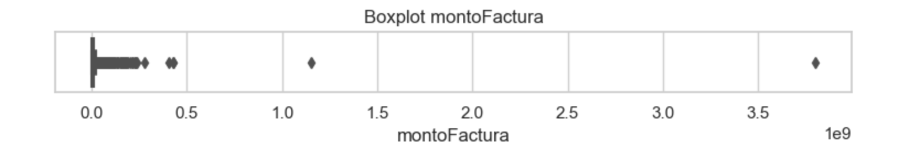
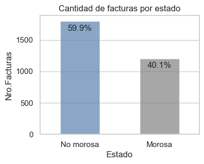
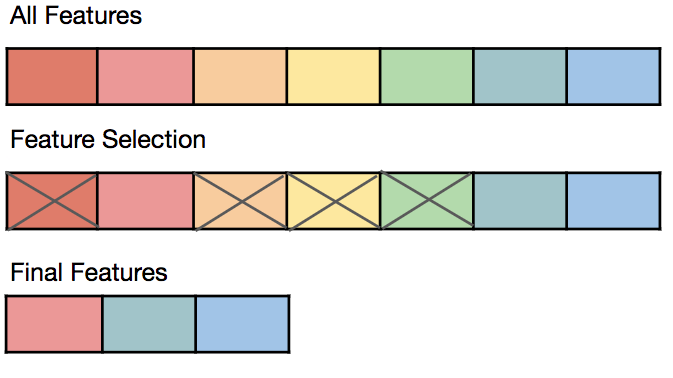
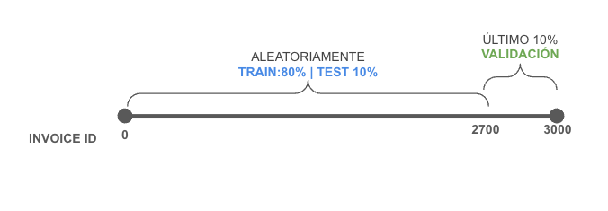
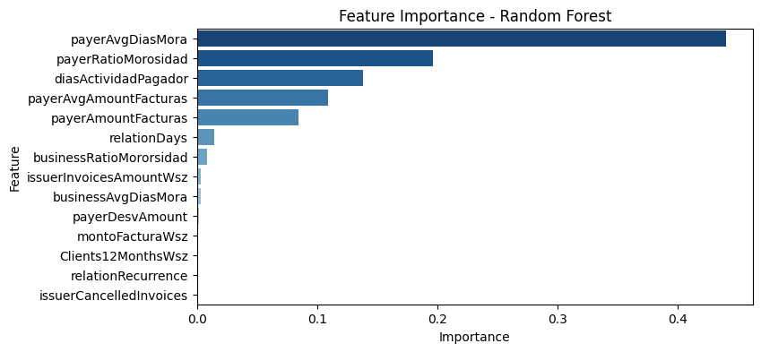
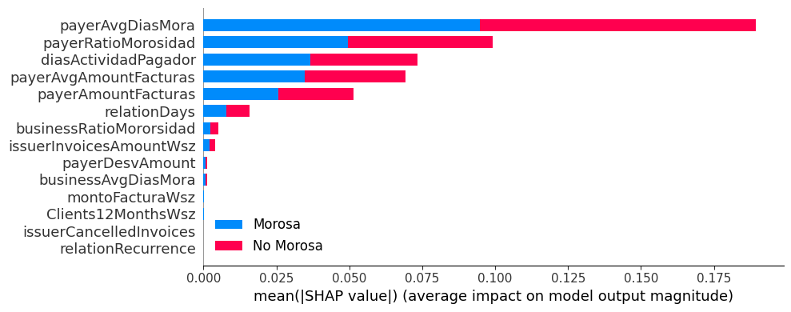
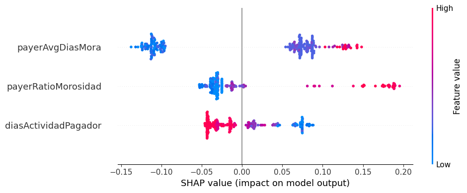

# Desarrollo del modelo de clasifición

## Descripción

El objetivo de este documento es explicar el proceso que se llevo a cabo para desarrollar un modelo que resuelva el modelo propuesto. Si bien en los notebooks incluidos en este repositorio se encuentra documentado y explicado cada paso, aquí sintetizaremos lo más relevante. La estructura de este documento estará alineada con la metodología **CRISP-ML**, que es la metodología que se siguió para el este desarrollo.

## 01 - Entendimiento de los datos y del problema

El primer paso realizado fué el de tener un primer acercamiento de los datos:

- Se obsevaron las variables y el tipo de cada una.
- Conocimos la dimensión del conjunto de datos.
- Buscamos valores faltantes.
- Buscamos duplicados.
- Buscamos outliers.
- Buscamos registros inconsistentes .

Además hicimos un primer planteamiento del problema definiendo el target y posible motivos que tengan influencia sobre este.

De este primer paso destacamos lo siguiente:

- El conjunto de datos contaba con 3000 registros y las columnas presentadas en el problema.
- No detectamos missings, duplicados o errores en el tipo de datos.
- Se detectaron registros donde la variable `relationDays` estaba en 0, y la `mora` era mayor a 0. Dado que el valor del primer campo de puede entender que se origina en la emisión de la primera facturas entras las partes, una factura debería ser emitida ya vencida. Dado que existian 38 casos de estos, se decidió no tenerlos en cuentra para el entrenamiento y la evaluación pero si para la generación de features históricos.
- Se detectaron registros donde la variable `issuerInvoicesAmount` estaba en 0. Validamos que este registro tenga este valor solo cuando la factura que lo contenga sea la primera.
- Detección de outliers: en todas las variables vimos a simple vista que había valores extremos. Volvimos a comprobar más de allá de observando plots con técnicas como **z-score** o **rango intercuantílico**. Determinamos que algunas variables tenían valores que a pesar de ser catalogados como outliers, parecían que a nivel de negocios podían ser valores correctos. Se decidió hacer un tratamiento sobre las variables `montoFactura`, `issuerInvoicesAmount` y `Clients12Months` que eran las más afectadas. Dado que en estas variables no importaba mantener la diferencia entre valores altos y bajos utilizamos **winsorazing** de forma asimétrica para procesarlos. Consiste en imputar valores extremos con el percentil 95.

El segundo paso fué buscar un orden cronológico para las facturas con el objetivo de poder generar features históricos.

- Para el **Business** pudimos observar que el campo para poder ordenar las operaciones era `invoiceId`.
- Para el **Payer** pudimos observar que los campos para poder ordenar las operaciones eran `diasActividadPagador` y `invoiceId`.

## 02 - Análisis exploratorio

El objetivo de este paso fue concluir sobre la relevancia que puede tener cada variable. En el notebook 02 se puede ver este proceso. Lo más destacable de este análisis fue saber que nos encontramos frente a un problema balanceado. Esto nos ahorra un dolor de cabeza, sin embargo todavía nos enfrentabamos al desafió de tener un modelo que funcione bien y no sobre ajuste.

## 03 - Ingeniería de variables

El objetivo de este paso fué buscar nuevas variables que puedan aporte a una mejor predicción del modelo. La búsqueda de estas nuevas variables estuvieron relacionadas con la historia de cada parte. También se construyó la variable a predecir. El resultado de este paso fué entonces:

- Creación del target `factMorosa`: es un bool que indica si la factura está morosa o no. 1 si es morosa, 0 si no lo es. Recordamos que se considera morosa si días de mora es mayor a 0.

Variables que representan el comportamiento del **Payer**:

- `payerRatioMorosidad`: ratio de facturas anteriores a la actual impagas.
- `payerAvgDiasMora`: promedio de días en cancelar las facturas anteriores a la actual.
- `payerDesvAmount`: cuanto se desvia en payer de sus gastos promedios. Es decir la factura actual que desvió tiene de la media de gastos en promedio que tuve el payer anteriormente.

Variables que representan el comportamiento del **Business**:

- `businessRatioMororsidad`: ratio de facturas impagas. Este feature es diferente el ratio de facturas canceladas, dado que una factura que no esté cancelada no significa que se encuentre morosa, dado que la fecha de vencimiento se pudo no haber cumplido.
- `businessAvgDiasMora`: promedio de días en cancelar las facturas que tienen sus clientes.

En este paso también se crearon variables auxiliares que en caso de que aparezcan en los siguientes pasos se dará una breve explicación.

## 04 - Selección de variables

Además del análisis exploratorio se utilizon otros métodos para decidir que variables seran utilizadas para entrenar al modelo. El objetivo de este paso no es solo seleccionar variables relevantes, sino que también nos sirve para quitarle complejidad al problema.
Estos métodos fueron:

- **Recursive Feature Elimination (RFE)** implica recursivamente ajustar el modelo y eliminando las variables menos importantes.
- **LassoCV** utiliza la regresión Lasso con validación cruzada para penalizar y seleccionar automáticamente las variables relevantes.
- **Feature Importance** evalúa la importancia de cada variable en un modelo de machine learning, asignándoles puntuaciones según su contribución al rendimiento del modelo.

La decisión que se tomó fue generar el dataset de entrenamiento con los siguientes features:

- `relationDays`: Número de días transcurridos desde el inicio de la relación comercial entre el emisor y el pagador.
- `relationRecurrence`: Frecuencia promedio de la interacción entre el emisor y el pagador en los últimos 12 meses.
- `issuerCancelledInvoices`: Número de facturas canceladas emitidas por el emisor.
- `diasActividadPagador`: Días transcurridos desde el inicio de las actividades del pagador.
- `montoFacturaWsz`: Monto de la factura luego de tratar outliers.
- `issuerInvoicesAmountWsz`: Monto total de facturas emitidas por el emisor luego de tratar outliers.
- `Clients12MonthsWsz`: Cantidad de clientes del emisor en los últimos 12 meses luego de tratar outliers.
- `payerRatioMorosidad`: Proporción de morosidad del pagador.
- `payerAmountFacturas`: Monto total de las facturas pagadas por el pagador.
- `payerAvgAmountFacturas`: Promedio del monto de las facturas pagadas por el pagador.
- `payerAvgDiasMora`: Promedio de los días de mora en el pago de facturas por parte del pagador.
- `payerDesvAmount`: Desviación estándar del monto de las facturas pagadas por el pagador.
- `businessRatioMororsidad`: Proporción de morosidad del facturas emitidas por emisor.
- `businessAvgDiasMora`: Promedio de los días de mora en el pago de facturas del emisor.
- `facturaMorosa`: Indicador de si la factura está en mora o no.

## 05 - Selección del modelo

En este paso evaluamos un conjunto de modelos y seleccionamos un modelo ganador dada las métricas definidas.

- Modelos evaluados: dado que nos encontrábamos ante un conjunto de variables con outliers, y a pesar de haber un tratamiento sobre algunos intentamos elegir modelos robustos para estos casos. Los modelos a evaluar fueron:

  - DecisionTreeClassifier
  - RandomForestClassifier
  - XGBoostClassifier

- Estrategía de splito de datos: dividimos el conjunto de entrenamiento de la siguiente forma:

  - Dejamos un 80% de datos para entrenar el modelo.
  - Apartamos un 10% para medir el desempeño del modelo.
  - Apartamos el último 10% de facturas emitidas para validar el modelo luego de hiperparametrizar. El objetivo es seleccionar facturas no vistas antes para poder evaluar la selección de hiperparámetros del modelo.

Dado que solo evaluamos modelos y todavía no vamos a ajustar hiperparámetros, no vamos a utilizar el conjunto de validación.

- Métricas de evaluación: existen diferentes métricas para evaluar modelos de clasificación. Se seleccionó para seleccionar al mejor modelo el **AUC** por los siguientes motivos:
  - **Desbalances de Clases:** robustes para problemas desbalanceados aunque este no es el caso. Est
  - **Umbrales de Clasificación:** ofrece robustez al evaluar modelos en diferentes umbrales de clasificación, mientras que el accuracy por ejemplo depende del umbral elegido.
  - **Sensibilidad a Falsos Positivos y Negativos:** capacidad para evaluar la capacidad del modelo de separar clases.

En caso de saber los objetivos que tiene el negocio y entender también el costo de tener falsos negativos o falsos positivos podríamos utilizar las métricas **recall** o **precision**. Dado que para elegir algunas de las dos necesitamos otra información es dificil seleccionarlas para la selección del modelo dado que no conoces el trade-off más conveniente.

- Resultados:

| Modelo                 | Precision (Negativo) | Precision (Positivo) | Recall (Negativo) | Recall (Positivo) | F1-score (Negativo) | F1-score (Positivo) | Accuracy | AUC  |
| ---------------------- | -------------------- | -------------------- | ----------------- | ----------------- | ------------------- | ------------------- | -------- | ---- |
| DecisionTreeClassifier | 0.69                 | 0.51                 | 0.69              | 0.51              | 0.69                | 0.51                | 0.62     | 0.60 |
| RandomForestClassifier | 0.71                 | 0.59                 | 0.78              | 0.51              | 0.74                | 0.55                | 0.67     | 0.72 |
| XGBClassifier          | 0.69                 | 0.54                 | 0.74              | 0.48              | 0.72                | 0.51                | 0.64     | 0.67 |

El modelo seleccionado luego de la evaluación fue el **RandomForestClassifier**. Procedemos al tuneo de hiperparámetros del mismo.

## 06 - Tuneo de hiperparámetros

El objetivo de este paso fué itentar encontrar los mejores hiperparámetros que maximizen el desempeño del modelo sobre la métrica seleccionada. Utilizamos la **Búsqueda Bayesiana** para esta búsqueda.

Los resultados que se obtuvieron luego de encontrar al "mejor modelo" fueron los siguientes:

| Conjunto   | Precision (Negativo) | Precision (Positivo) | Recall (Negativo) | Recall (Positivo) | F1-score (Negativo) | F1-score (Positivo) | Accuracy | AUC  |
| ---------- | -------------------- | -------------------- | ----------------- | ----------------- | ------------------- | ------------------- | -------- | ---- |
| Test       | 0.75                 | 0.57                 | 0.69              | 0.63              | 0.72                | 0.60                | 0.67     | 0.74 |
| Validación | 0.82                 | 0.49                 | 0.75              | 0.59              | 0.78                | 0.54                | 0.70     | 0.71 |

Obtuvimos una mejora en la métrica optimizida y pudimos validar que no hayamos caidos en sobreajuste. Algunas métricas que depende de los aciertos se ven más altas en el conjunto de validación que en el test, pero esto simplemente se debe a que al haber pocos datos, el acierto o no de un registro en particular mueve muchísimo el valor de la métrica.

## 07 - Variables más importantes

En la consiga se solicitó seleccionar las 3 variables más importantes para explicar los resultados. Volvimos a utilizar **feature importance** para sacar alguna conclusión al respecto y también utilizamos SHAP values como para ver si se podía decir algo más al respecto.

**Feature importance** es una medida importante que permite tener una idea de la contribución de las variables al poder predictivo del modelo. La importancia se mide dada la capacidad que tiene la variable de discriminar correctamente entre las clases. Estas son las interpretaciones generales. Dado esta métrica, las 3 variables más importantes que nos ayudan a explicar los resultados son:

- `payerAvgDiasMora`.
- `payerRatioMorosidad`.
- `diasActividadPagador`.

**SHAP (SHapley Additive exPlanations)** es un método que utiliza la teoría de juegos para asignar contribuciones individuales de características a las predicciones de un modelo de machine learning, proporcionando explicaciones interpretables y consistentes sobre cómo cada característica afecta las predicciones.

Podemos observar también que dado los SHAP values las variables más importantes son las mismas. Además, viendo el siguiente plot podemos observar como cada uno de estos afecta a la predicción.

La interpretación es la siguiente:

- `payerAvgDiasMora`: valores más altos de esta variable produce que la probabilidad de que una factura sea morosa sea mayor.
- `payerRatioMorosidad`: lo mismo sucede con este feature.
- `diasActividadPagador`: Todo lo contrario pasa con esta variable, como vimos anteriormente en el análisis exploratorio, al parecer los pagadores con más antiguedad suelen ser más confiable.

## Notas finales

Esto fué un breve resumen del trabajo realizado. En los notebooks encontrán todo el código desarrallorado para el desarrollo de esta solución así como toda la explicación del mismo.
